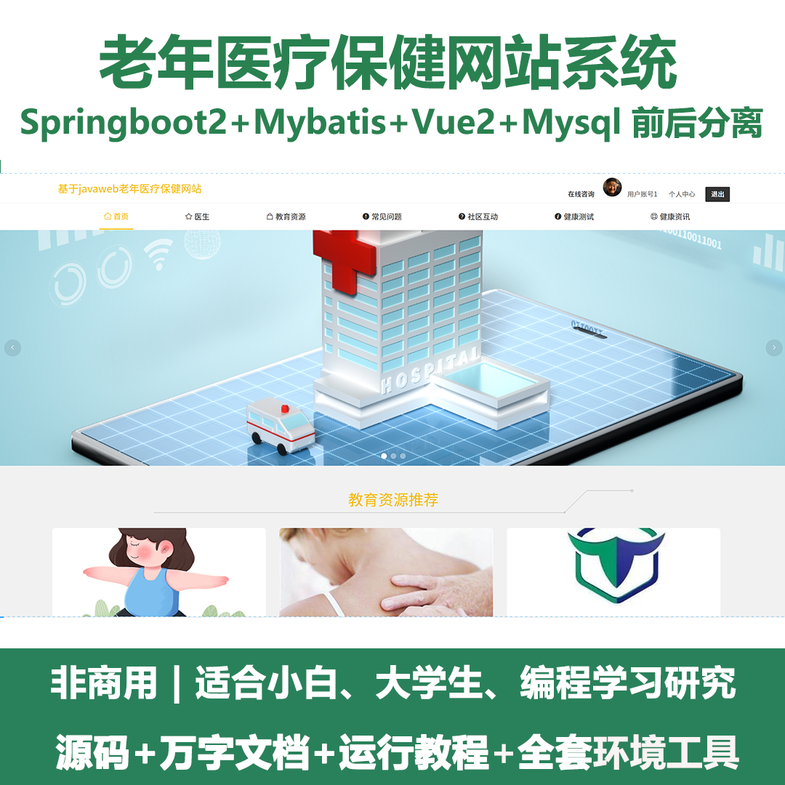
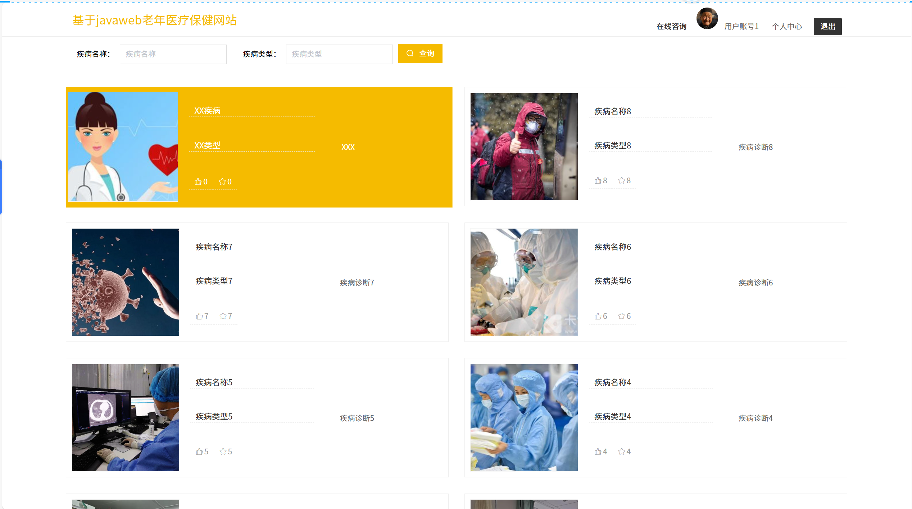
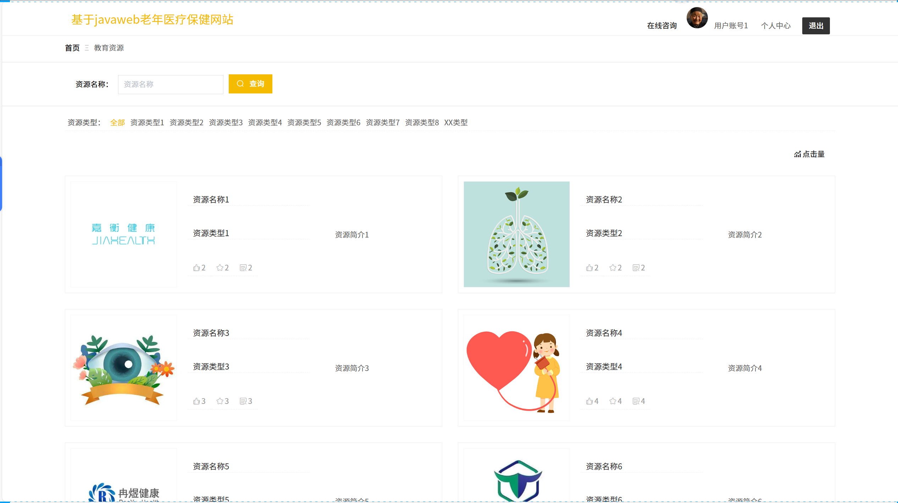
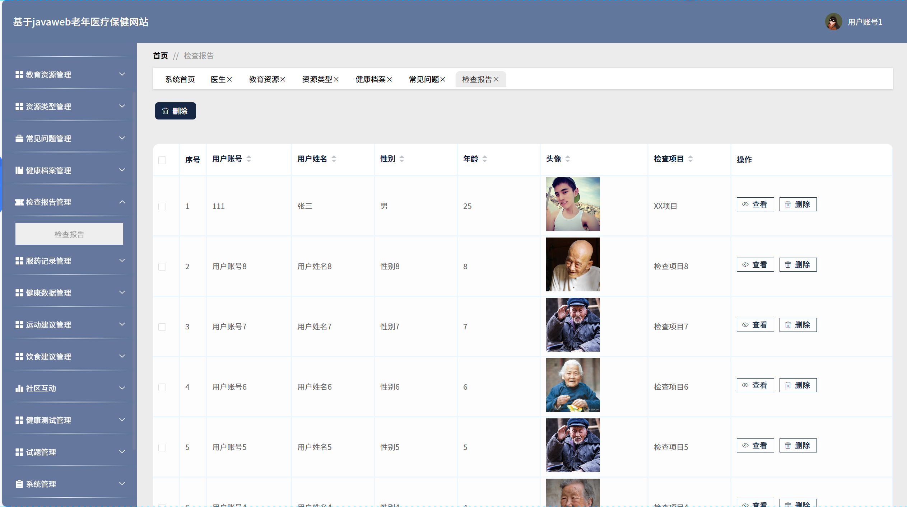
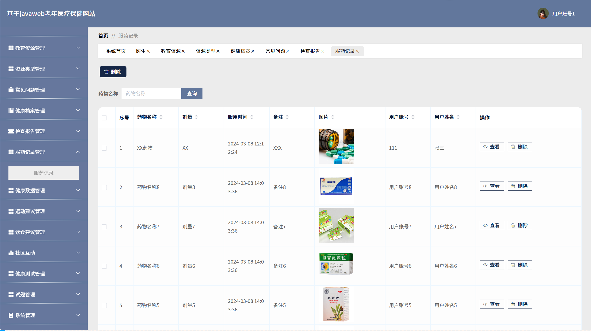
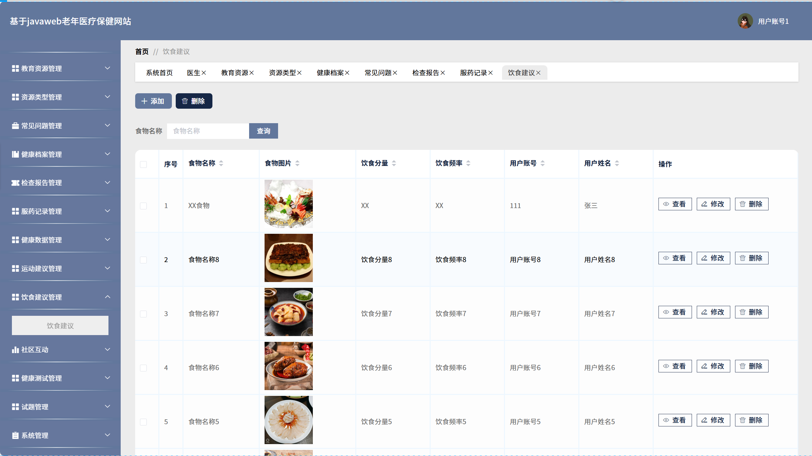
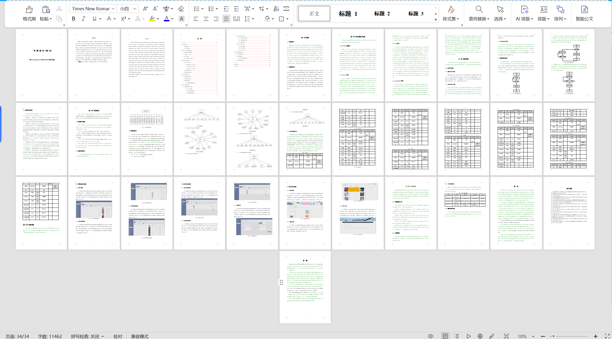

# springbootA408
springbootA408老年医疗保健网站+LW
 
## 查看主页获取源码

### 一、关键词

老年医疗健康网站平台，老年健康医疗服务平台，中老年医疗保健系统

 

### 二、作品包含

源码+数据库+设计文档万字+全套环境和工具资源+部署教程

 

### 三、项目技术

前端技术：Html、Css、Js、Vue2.0、Element-ui 
后端技术：Java、SpringBoot2.0、MyBatis

  

 

### 四、运行环境（以下版本亲测，其他版本未知，请自测）

开发工具：IDEA/eclipse  + VSCODE

数据库：MySQL5.7（最低要5.7版本）

数据库管理工具：Navicat10以上版本

环境配置软件： JDK1.8 + Maven3.6.3

前端Nodejs：14

浏览器：谷歌浏览器

 

### 五、项目介绍

项目编号：springbootA408

设计并实现一款基于Spring Boot框架的老年医疗保健网站，以满足老年人群体的健康管理和医疗服务需求。通过该网站，老年人可以方便地获取健康资讯、预约医生、查看医疗机构信息等功能。本文首先分析了老年人的特殊需求和现有医疗保健网站存在的不足之处，然后提出了基于Spring Boot的网站设计方案，并详细介绍了实现过程中所采用的技术和方法
### 六、运行截图

